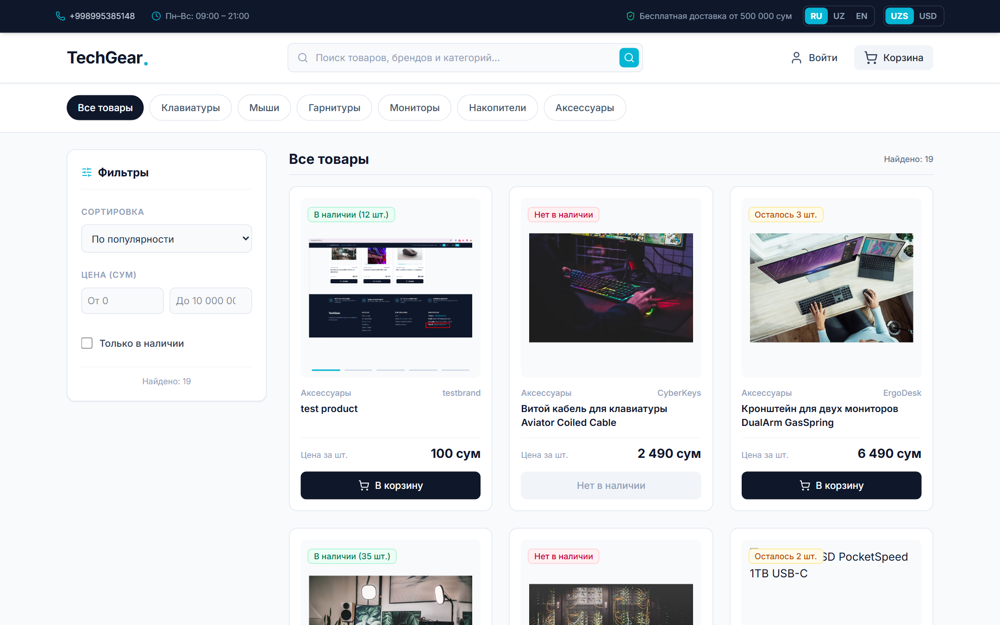
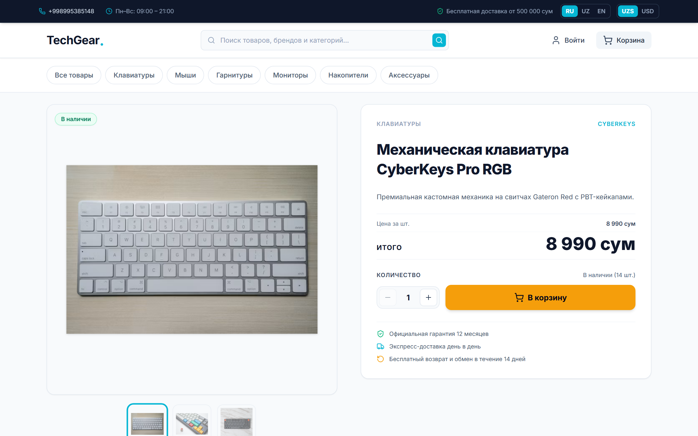
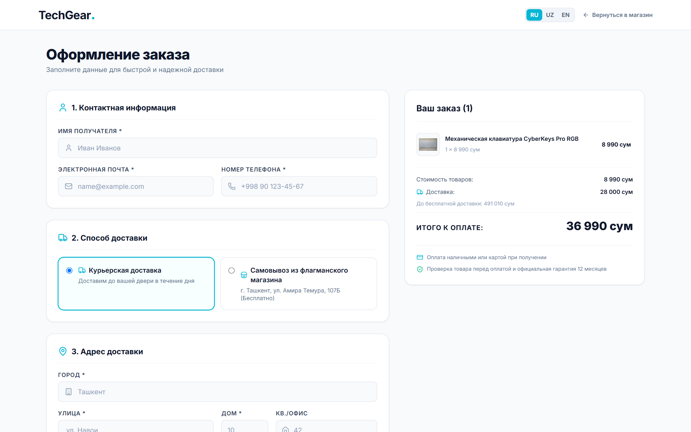
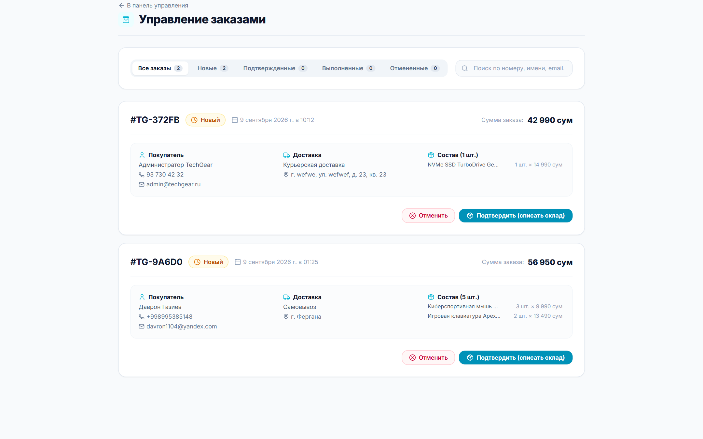
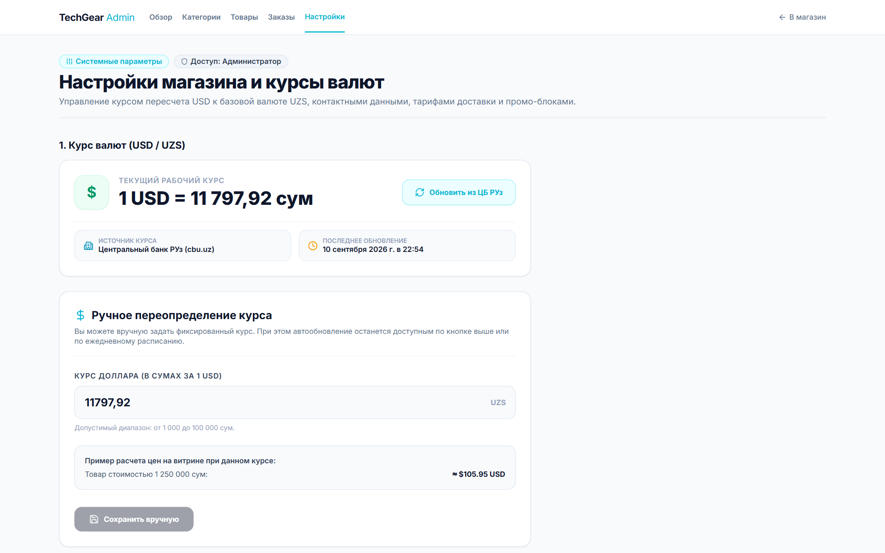
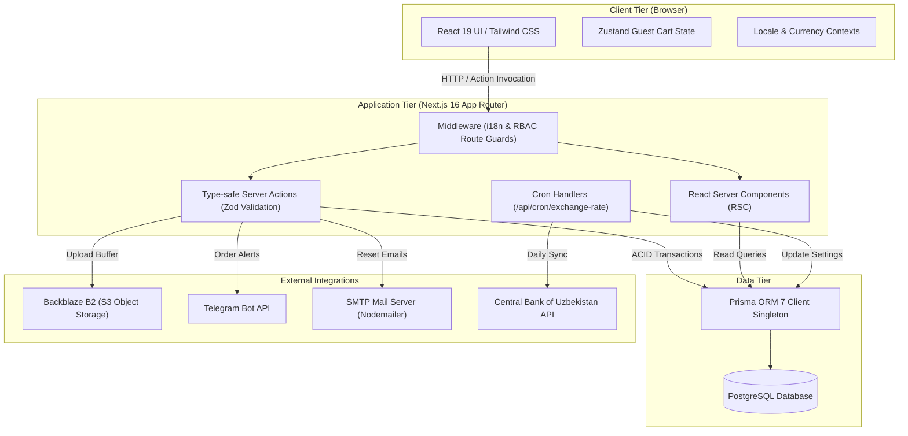

# ⚡ TechGear

> **Full-Stack E-Commerce platform for high-performance computer hardware, gaming peripherals, and accessories.**

[](https://github.com/davron1104/TechGear/actions/workflows/ci.yml)
[](https://nextjs.org/)
[](https://react.dev/)
[](https://www.typescriptlang.org/)
[](https://www.prisma.io/)
[](https://www.postgresql.org/)
[](https://tailwindcss.com/)
[](https://vitest.dev/)
[](https://playwright.dev/)

---

## 🌐 Live Demo & Production Deployment

* **Production URL:** [https://techgear-sooty.vercel.app](https://techgear-sooty.vercel.app)
* **Hosting:** Vercel
* **Database:** Neon PostgreSQL
* **Object Storage:** Backblaze B2 (S3-compatible API)
* **Supported Languages:** 🇷🇺 Русский | 🇺🇿 O'zbekcha | 🇬🇧 English
* **Supported Currencies:** UZS (So'm) / USD ($)

### 🔑 Local Development Test Accounts

The project seed script (`prisma/seed.ts`) creates test accounts for local development and testing.

Production credentials are intentionally not published in this repository.

---

## 📸 Screenshots

### 1. Catalog & Faceted Filtering


### 2. Product Details & Technical Specifications


### 3. Checkout & Order Summary


### 4. Admin Order Management


### 5. Store Settings & Currency Integration


---

## 🚀 Key Features

### 🛍️ Customer Experience
* **Multilingual Catalog & Advanced Filtering:** Real-time multi-criteria filtering (category, price range, brand, stock availability, sort order, and search queries).
* **Detailed Product Presentation:** Dynamic image gallery with thumbnails, comprehensive technical specification tables, stock status indicators, and sticky buy bar on scroll.
* **Interactive Cart Drawer:** Sliding shopping cart with instant quantity adjustments, stock limit validation, and local persistence.
* **Cart Synchronization:** Seamless atomic merge of guest cart items (Zustand) into database storage (Prisma) upon user authentication.
* **Streamlined Checkout:** Multi-step delivery calculation (Courier / Pickup), dynamic delivery costs, order summary, and real-time validation.
* **Customer Dashboard:** Personal profile management, order history tracking, detailed item breakdowns, and user-initiated order cancellation for new orders.
* **Currency & Language Switchers:** Instant currency conversion (UZS default, live USD calculation) and localized path-based routing (`/[locale]/`).
* **Self-Service Password Reset:** Token-based password recovery with localized transactional email notifications.

### 🛡️ Admin Management Panel
* **Protected Dashboard:** Role-based access control (RBAC) enforced via Next.js Middleware and server-side session verification.
* **Product Catalog CRUD:** Create, edit, and soft-delete products with full multi-language translations and specifications.
* **Cloud Media Upload:** Direct image streaming to Backblaze B2 S3 storage with server-side MIME type and size validation (up to 5 MB).
* **Category Management:** Create and organize product categories with multilingual slugs and titles.
* **Order Processing & Inventory Control:** Real-time order review, customer contact information, and state transitions (`NEW` → `CONFIRMED` → `COMPLETED` / `CANCELLED`).
* **Store Settings & Exchange Rate Control:** Manual and automated USD exchange rate management, custom store address, and working hours.

---

## 💡 Engineering Highlights

* **Zero-Trust Server Actions:** All business mutations are executed via Next.js 16 Server Actions. Incoming parameters are strictly parsed using Zod schemas with a whitelist approach. Prices and totals are always calculated server-side from the database to eliminate client tampering.
* **Atomic Interactive Transactions:** Critical operations—including order creation, cart merging, and status updates—execute inside Prisma `$transaction` blocks to ensure ACID compliance.
* **Guest-to-Authenticated Cart Merging:** When a guest logs in, the client state is synchronized with the database in a single transaction, taking into account current product availability and active stock limits.
* **Two-Phase Inventory Management:** Order creation validates available stock without premature deduction; physical inventory decrement is executed atomically when an administrator confirms the order (`CONFIRMED`), preventing overselling and race conditions.
* **Soft-Delete Architecture:** Deleting products with existing purchase history marks them with `deletedAt` rather than executing a hard cascade delete, preserving historical order record integrity (`OrderItem`).
* **Reliable External Integrations:**
  * **Telegram Bot API:** Asynchronous order notification dispatch with HTML formatting, token safety, and non-blocking failure isolation.
  * **CBU Exchange Rate Cron:** Secured endpoint (`/api/cron/exchange-rate`) querying the Central Bank of Uzbekistan API for automated daily currency updates.
  * **Nodemailer SMTP:** Multi-language transactional email templates for password reset workflows.

---

## 🛠️ Tech Stack

| Domain | Technologies |
| :--- | :--- |
| **Frontend Framework** | [Next.js 16](https://nextjs.org/) (App Router, Server & Client Components), [React 19](https://react.dev/) |
| **Language & Typing** | [TypeScript 5](https://www.typescriptlang.org/) (Strict Mode) |
| **Styling & Design** | [Tailwind CSS v4](https://tailwindcss.com/), [Lucide React](https://lucide.dev/) |
| **State Management** | [Zustand](https://zustand-demo.pmnd.rs/) (Client Cart & UI State) |
| **Database & ORM** | [PostgreSQL 16](https://www.postgresql.org/), [Prisma ORM 7](https://www.prisma.io/) |
| **Authentication** | [Auth.js v5 (NextAuth)](https://authjs.dev/) (JWT Sessions, Credentials Provider, Bcryptjs) |
| **Data Validation** | [Zod 4](https://zod.dev/), [React Hook Form](https://react-hook-form.com/) |
| **Object Storage** | [Backblaze B2](https://www.backblaze.com/b2/) via [@aws-sdk/client-s3](https://aws.amazon.com/sdk-for-javascript/) |
| **External APIs** | Telegram Bot API, Central Bank of Uzbekistan (CBU) Rate API, Nodemailer |
| **Testing** | [Vitest](https://vitest.dev/), React Testing Library, [Playwright](https://playwright.dev/) (E2E) |
| **CI / CD** | GitHub Actions (Lint, Typecheck, Vitest, PostgreSQL Service, Playwright) |
| **Deployment** | [Vercel](https://vercel.com/), [Neon PostgreSQL](https://neon.tech/) |

---

## 🏗️ Architecture & Data Flow



---

## 🔒 Authentication & Security

* **Role-Based Access Control (RBAC):** Distinct `CUSTOMER` and `ADMIN` roles verified at both route-level (Next.js Middleware) and action-level inside server functions.
* **Password Hashing:** Cryptographic hashing with `bcryptjs` and salted rounds.
* **Password Reset Security:** Single-use crypto tokens stored with expiration timestamps; passwords are updated through server actions with token invalidation.
* **Input Whitelisting:** Server-side parsing with Zod ensures only permitted fields reach database queries.
* **Safe Error Handling:** Database and network errors are caught, logged server-side, and sanitized before returning user-friendly messages to the client.
* **Secret Isolation:** API tokens, database connection strings, and storage keys are managed strictly via server environment variables.

---

## 🌍 Internationalization (i18n) & Currencies

* **Supported Locales:** Russian (`ru`), Uzbek (`uz`), English (`en`).
* **Route Structure:** Localized routing pattern (`/[locale]/...`) powered by server-side dictionary loaders.
* **Localized Database Content:** Products and categories store multi-language titles and specifications in structured JSON fields.
* **Transactional Emails:** Password reset emails are rendered in the language selected by the user.
* **Dynamic Currency Engine:** Real-time conversion between Uzbekistani So'm (`UZS`) and US Dollar (`USD`), backed by automated CBU exchange rate synchronization.

---

## 🧪 Testing & Quality Assurance

The codebase employs a multi-tiered automated test suite:

```bash
# Run unit, integration, and component tests
npm run test:run

# Run tests with code coverage
npm run test:coverage

# Run end-to-end (E2E) tests with Playwright
npm run test:e2e

# Run linter
npm run lint

# Typecheck TypeScript
npx tsc --noEmit
```

* **Unit & Integration Tests (Vitest):** Tests covering Server Actions, Zod validation schemas, exchange rate services, Telegram alerting, S3 upload logic, and helper libraries.
* **Component Tests:** Verification of cart drawer interactions, buy-box state, catalog filters, language switchers, and layout components using React Testing Library.
* **E2E Tests (Playwright):** Full-flow testing of catalog browsing, cart operations, multi-step checkout, and responsive mobile navigation across Chromium.

---

## 🔄 CI/CD Pipeline

Automated quality control is executed on every commit and pull request via **GitHub Actions** ([`.github/workflows/ci.yml`](.github/workflows/ci.yml)):

1. **Lint & Typecheck:** ESLint and strict TypeScript validation.
2. **Unit & Integration Tests:** Vitest test suite execution.
3. **Containerized Build:** Starts a dedicated `postgres:16-alpine` service container, pushes schema via Prisma, runs seed scripts, and executes production `next build`.
4. **End-to-End Suite:** Runs Playwright E2E browser tests against the assembled build and database container.

---

## 💻 Local Development Setup

### Prerequisites
* **Node.js:** v20.x or higher
* **PostgreSQL:** Local instance or cloud database (e.g. Neon / Supabase)
* **npm:** v10.x or higher

### Step-by-Step Installation

1. **Clone the repository:**
   ```bash
   git clone https://github.com/davron1104/TechGear.git
   cd TechGear
   ```

2. **Install dependencies:**
   ```bash
   npm install
   ```

3. **Configure Environment Variables:**
   Copy the example environment configuration:
   ```bash
   cp .env.example .env
   ```
   Configure your `DATABASE_URL` and `AUTH_SECRET` / `NEXTAUTH_SECRET` in `.env`.

4. **Initialize Database & Seed Data:**
   ```bash
   # Push schema migrations to the database
   npx prisma migrate dev

   # Populate catalog with demo products, categories, and test accounts
   npx prisma db seed
   ```

5. **Start the Development Server:**
   ```bash
   npm run dev
   ```
   Open [http://localhost:3000](http://localhost:3000) in your browser.

---

## 🤖 AI-Assisted Engineering

This project was built leveraging modern AI-assisted pair programming workflows. System requirements, security invariants, and database rules were defined upfront (see `.agents/rules/`), while all generated code, server mutations, transactions, and test suites were strictly reviewed, refactored, and validated against automated CI pipelines by the engineer.

---

## 📄 License

This project is open-source and available under the [MIT License](LICENSE).
