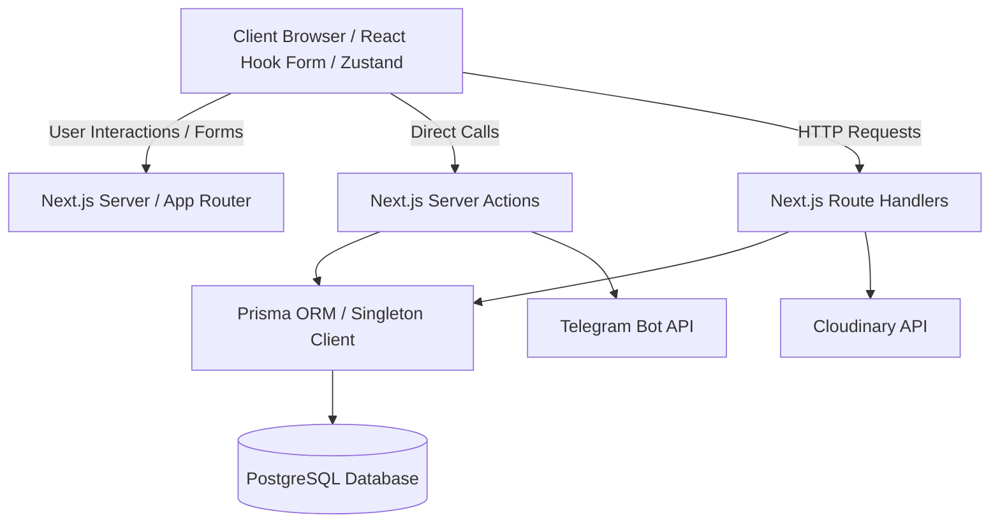
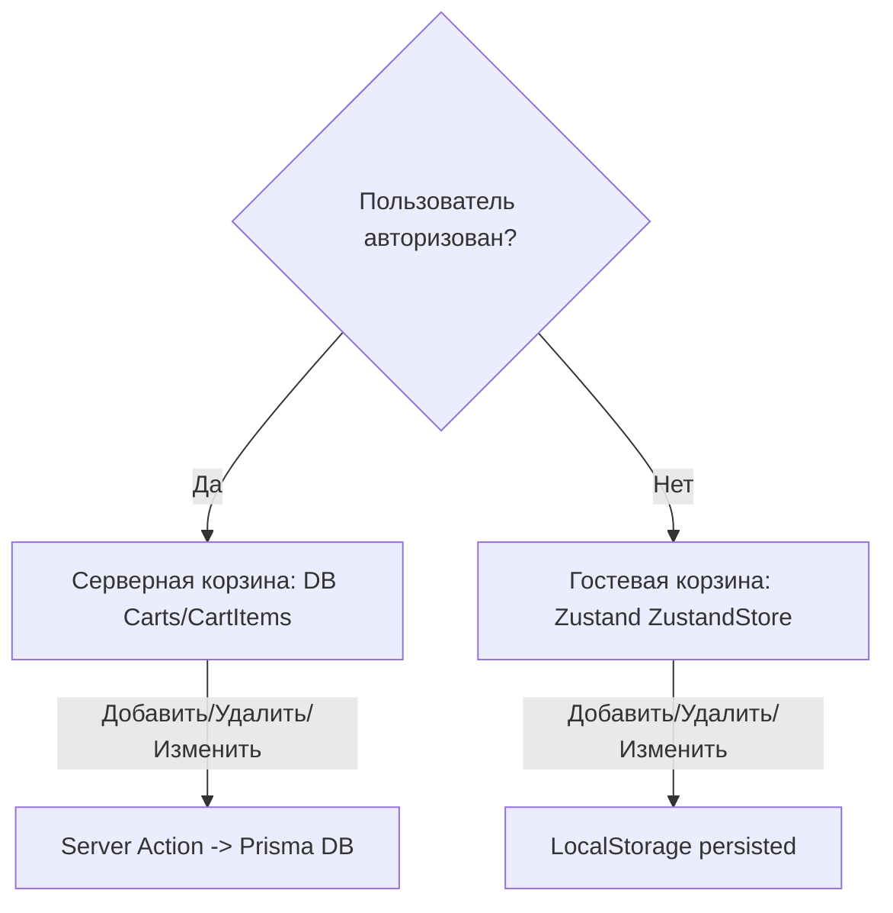
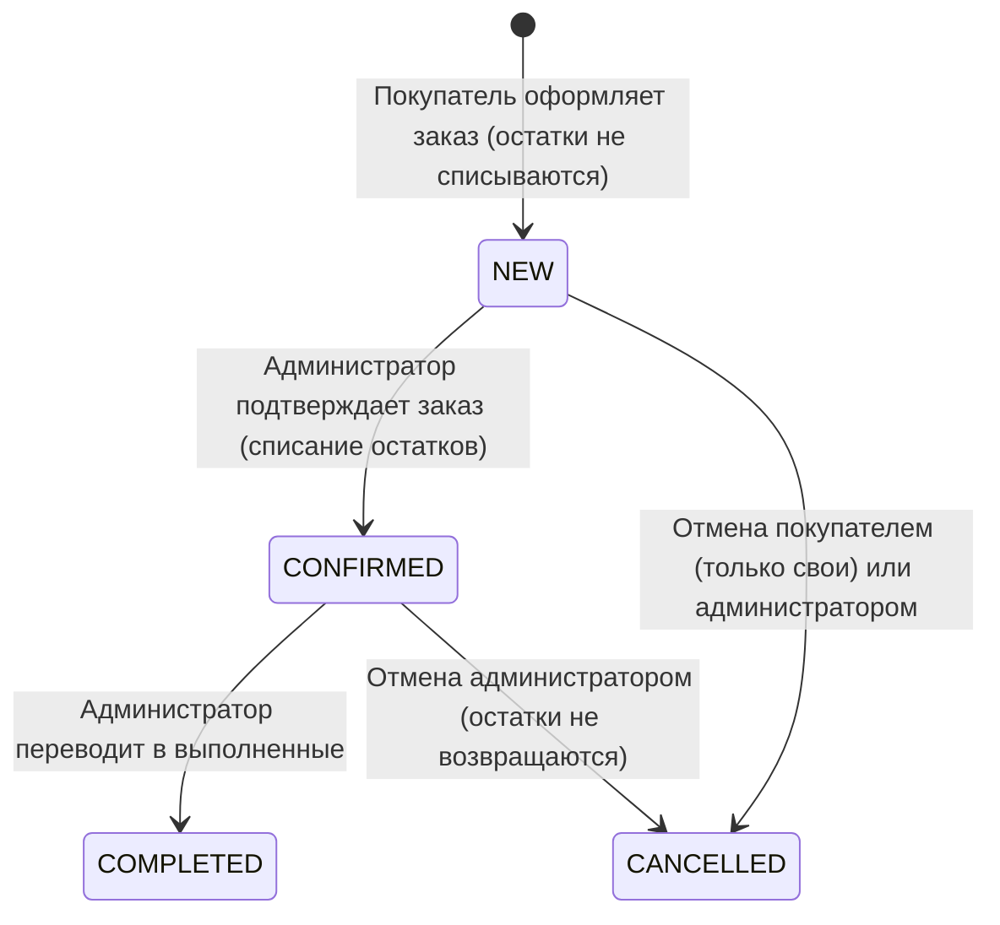

# Архитектура проекта TechGear (Architecture.md)

В данном документе приведено детальное описание архитектуры, структуры данных, ключевых модулей и механизмов работы небольшого интернет-магазина компьютерной техники и аксессуаров **TechGear**.

Проектирование выполнено строго на основе требований [TZ.md](file:///c:/Users/User/Desktop/internetMagazine_AI/TZ.md) и технологического стека из [stack.md](file:///c:/Users/User/Desktop/internetMagazine_AI/stack.md).

---

## 1. Общая архитектура приложения

Приложение TechGear проектируется как **Full-stack монолит** на базе фреймворка **Next.js (App Router)** с использованием **TypeScript**.

### Ключевые архитектурные паттерны:
1. **Server-Side Rendering (SSR) и React Server Components (RSC)**:
   - Получение данных для каталога товаров, категорий и страниц товаров происходит напрямую на сервере (Server-side) через Prisma ORM. Это исключает лишние сетевые запросы (API fetch) между клиентом и сервером, минимизирует размер JS-бандла, отправляемого клиенту, и обеспечивает высокие показатели SEO и FCP (First Contentful Paint).
   - Статические страницы (например, о магазине) используют Static Site Generation (SSG).
2. **Client Components**:
   - Используются локально для интерактивных элементов UI: виджет корзины, формы авторизации/регистрации, фильтры каталога, динамическое добавление характеристик в админ-панели.
3. **Next.js Server Actions (Бизнес-логика бэкенда)**:
   - Вся мутация данных (добавление в корзину, оформление заказа, подтверждение заказа, CRUD для товаров и категорий) реализуется через асинхронные Server Actions. Это позволяет отказаться от классических API-контроллеров для внутренних нужд.
4. **Next.js Route Handlers (REST API)**:
   - Используются для авторизации (интеграция с Auth.js) и внешних интеграций/загрузок файлов, где требуется стандартный HTTP-протокол.
5. **Database Layer (Prisma & PostgreSQL)**:
   - Слой доступа к данным абстрагирован с помощью Prisma ORM. PostgreSQL выступает в качестве надежной реляционной СУБД.



---

## 2. Структура директорий и файлов проекта

Проект организован по модульно-функциональному принципу, рекомендованному для Next.js App Router.

```
/
├── prisma/                  # Схема базы данных Prisma и файлы миграций
│   ├── schema.prisma        # Описание сущностей (User, Product, Order, etc.)
│   └── seed.ts              # Скрипт наполнения тестовым каталогом (18-20 товаров)
├── public/                  # Статические ресурсы (логотипы, иконки, глобальные шрифты)
├── src/
│   ├── app/                 # Маршрутизация App Router (Страницы и API)
│   │   ├── (auth)/          # Маршруты авторизации покупателя
│   │   │   ├── login/       # Страница входа (/login)
│   │   │   └── register/    # Страница регистрации (/register)
│   │   ├── (customer)/      # Личный кабинет покупателя
│   │   │   └── account/     # Профиль и история заказов (/account, /account/orders/[id])
│   │   ├── admin/           # Административная панель
│   │   │   ├── login/       # Вход для администратора (/admin/login)
│   │   │   ├── categories/  # Управление категориями (/admin/categories)
│   │   │   ├── products/    # Управление товарами (/admin/products)
│   │   │   └── orders/      # Управление заказами (/admin/orders)
│   │   ├── api/             # API Route Handlers
│   │   │   └── auth/        # Маршруты Auth.js (NextAuth)
│   │   ├── product/         # Страница товара (/product/[slug])
│   │   ├── layout.tsx       # Глобальный Layout (провайдеры, Zustand-синхронизатор)
│   │   └── page.tsx         # Главная страница (Каталог товаров с фильтрами)
│   ├── components/          # React-компоненты
│   │   ├── ui/              # Библиотека UI-компонентов shadcn/ui (директория по умолчанию)
│   │   ├── admin/           # Специфичные компоненты админки (таблицы, формы)
│   │   ├── cart/            # Виджет корзины (боковая панель)
│   │   └── catalog/         # Карточка товара, панель фильтров
│   ├── actions/             # Next.js Server Actions (бизнес-логика бэкенда)
│   │   ├── auth-actions.ts  # Регистрация, обновление профиля
│   │   ├── product-actions.ts # CRUD товаров
│   │   ├── category-actions.ts # CRUD категорий
│   │   ├── cart-actions.ts  # Синхронизация и слияние корзин
│   │   └── order-actions.ts # Создание, подтверждение, изменение статусов заказов
│   ├── hooks/               # Кастомные React-хуки (клиентская логика)
│   │   └── use-cart.ts      # Zustand-стор для гостевой корзины + persist в localStorage
│   ├── lib/                 # Настройки клиентов, утилиты и синглтоны
│   │   ├── prisma.ts        # Синглтон Prisma Client
│   │   ├── auth.ts          # Конфигурация Auth.js (NextAuth v5)
│   │   ├── cloudinary.ts    # Настройка SDK Cloudinary
│   │   ├── telegram.ts      # Сервис для отправки уведомлений в Telegram
│   │   └── utils.ts         # Утилиты (например, tailwind-merge)
│   ├── services/            # Сервисный слой для сложной бизнес-логики
│   │   ├── stock-service.ts # Логика проверки и списания остатков (транзакции)
│   │   └── cart-service.ts  # Логика слияния гостевой и пользовательской корзин
│   ├── types/               # TypeScript типы и интерфейсы
│   └── validators/          # Zod схемы валидации для форм и Server Actions
├── tests/                   # Конфигурации и файлы тестов
│   ├── unit/                # Unit и интеграционные тесты (Vitest)
│   └── e2e/                 # Сценарии сквозного тестирования (Playwright)
```

---

## 3. Основные модули и их ответственность

### 3.1. Модуль авторизации (Auth Module)
- **Ответственность**: Регистрация покупателей, хеширование паролей, аутентификация, восстановление доступа по email, управление сессиями, защита ролей (CUSTOMER / ADMIN).
- **Основные технологии**: Auth.js, bcryptjs, Zod.

### 3.2. Модуль каталога (Catalog Module)
- **Ответственность**: Вывод товаров, фильтрация по категориям, отображение детальной страницы товара, проверка наличия товара на складе.
- **Основные технологии**: React Server Components, Prisma Client, Zod.

### 3.3. Модуль корзины (Cart Module)
- **Ответственность**: Добавление, изменение количества и удаление товаров из корзины. Разделение логики для гостя и авторизованного пользователя. Алгоритм слияния корзин.
- **Основные технологии**: Zustand + LocalStorage (клиент), Prisma (сервер), Server Actions.

### 3.4. Модуль заказов (Order Module)
- **Ответственность**: Оформление заказа, валидация полей, сохранение истории цен/названий в `OrderItem`, транзакционная обработка.
- **Основные технологии**: React Hook Form, Zod, Prisma Transactions.

### 3.5. Модуль административной панели (Admin Module)
- **Ответственность**: Управление товарами (CRUD + динамические характеристики), управление категориями, управление заказами (изменение статусов, просмотр покупателей), управление остатками на складе.
- **Основные технологии**: React, Server Actions, shadcn/ui.

### 3.6. Модуль интеграций (Integration Module)
- **Ответственность**: Загрузка изображений в Cloudinary, отправка уведомлений администраторам о новых заказах через Telegram Bot API.
- **Основные технологии**: Cloudinary SDK, Telegram Bot API, Node.js Fetch.

---

## 4. Взаимодействие Frontend, Backend и Базы Данных

Приложение использует бесшовную интеграцию Next.js:

```
[Пользовательский интерфейс (Client Component)]
        │
        │ (1) Вызывает Server Action (например, checkout(formData))
        ▼
[Next.js Server (Server Action / Node.js)]
        │
        │ (2) Валидирует входящие данные с помощью Zod-схемы
        │ (3) Запрашивает сессию через Auth.js (проверка прав роли)
        │ (4) Инициализирует Prisma Transaction
        ▼
[Prisma Client (Singleton)]
        │
        │ (5) Открывает транзакцию в БД
        ▼
[PostgreSQL Database]
        │
        │ (6) Выполняет SQL-запросы (SELECT, UPDATE, INSERT)
        │     с использованием блокировок (Row Locking)
        ▼
[Prisma Client (Singleton)]
        │
        │ (7) Возвращает типизированный результат
        ▼
[Next.js Server (Server Action)]
        │
        │ (8) Коммитит транзакцию
        │ (9) Триггерит фоновую отправку сообщения в Telegram Bot API
        │ (10) Возвращает структурированный ответ { success: true, data }
        ▼
[Пользовательский интерфейс (Zustand / React State)]
        │
        │ (11) Очищает корзину на клиенте, показывает страницу успеха
```

---

## 5. Основные сущности и связи между ними (Схема БД)

Для работы с PostgreSQL через Prisma ORM проектируются следующие сущности.

### Проектирование динамических характеристик товара:
В соответствии с ТЗ: *"Разные категории имеют разные характеристики... Администратор может добавлять необходимое количество характеристик"*.
- **Решение**: Характеристики хранятся в поле `characteristics` модели `Product` в формате **JSONB** (тип `Json` в Prisma). Это позволяет избежать оверхеда сложной EAV (Entity-Attribute-Value) схемы, упрощает запросы выборки и гарантирует высокую производительность PostgreSQL при поиске и фильтрации. Данные валидируются схемой `z.record(z.string())`.

### Проектирование безопасного удаления:
1. **Удаление товара**: Физическое удаление товара (`DELETE`) нарушит внешние ключи в существующих заказах (`OrderItem`).
   - **Решение**: Используется стратегия **Soft Delete** (мягкое удаление) через поле `deletedAt DateTime?`. При удалении товара администратором поле заполняется текущей датой. Товар исключается из каталога (`where: { deletedAt: null }`), но записи в `OrderItem` сохраняют валидную связь `productId` с товаром для аналитики.
   - Также в `OrderItem` дублируются поля `productName` и `price` на момент покупки (требование ТЗ для сохранения истории цен). На всякий случай связь `productId` в `OrderItem` настраивается как `onDelete: SetNull`, а поле является опциональным (`productId String?`).
2. **Удаление категории**:
   - **Решение**: Удаление категории блокируется на уровне бизнес-логики Server Action, если в ней содержится хотя бы один активный товар (где `deletedAt: null`). Администратору выводится ошибка с требованием перенести или удалить товары.

### Prisma Schema (`schema.prisma`):

```prisma
datasource db {
  provider = "postgresql"
  url      = env("DATABASE_URL")
}

generator client {
  provider = "prisma-client-js"
}

enum Role {
  CUSTOMER
  ADMIN
}

enum OrderStatus {
  NEW
  CONFIRMED
  COMPLETED
  CANCELLED
}

model User {
  id           String    @id @default(uuid())
  name         String
  email        String    @unique
  passwordHash String
  phone        String?
  role         Role      @default(CUSTOMER)
  createdAt    DateTime  @default(now())
  updatedAt    DateTime  @updatedAt
  cart         Cart?
  orders       Order[]

  @@map("users")
}

model PasswordResetToken {
  id        String   @id @default(uuid())
  email     String
  token     String   @unique
  expires   DateTime
  createdAt DateTime @default(now())

  @@unique([email, token])
  @@map("password_reset_tokens")
}

model Category {
  id        String    @id @default(uuid())
  name      String
  slug      String    @unique
  createdAt DateTime  @default(now())
  updatedAt DateTime  @updatedAt
  products  Product[]

  @@map("categories")
}

model Product {
  id               String      @id @default(uuid())
  name             String
  slug             String      @unique
  categoryId       String
  category         Category    @relation(fields: [categoryId], references: [id])
  price            Decimal     @db.Decimal(10, 2) // Decimal для предотвращения ошибок округления Float
  image            String      // Cloudinary URL
  shortDescription String
  description      String
  stock            Int
  characteristics  Json        // JSONB для динамических характеристик: Record<string, string>
  deletedAt        DateTime?   // Для Soft Delete
  createdAt        DateTime    @default(now())
  updatedAt        DateTime    @updatedAt
  cartItems        CartItem[]
  orderItems       OrderItem[]

  @@map("products")
}

model Cart {
  id        String     @id @default(uuid())
  userId    String     @unique
  user      User       @relation(fields: [userId], references: [id], onDelete: Cascade)
  items     CartItem[]
  createdAt DateTime   @default(now())
  updatedAt DateTime   @updatedAt

  @@map("carts")
}

model CartItem {
  id        String   @id @default(uuid())
  cartId    String
  cart      Cart     @relation(fields: [cartId], references: [id], onDelete: Cascade)
  productId String
  product   Product  @relation(fields: [productId], references: [id], onDelete: Cascade)
  quantity  Int
  createdAt DateTime @default(now())
  updatedAt DateTime @updatedAt

  @@unique([cartId, productId])
  @@map("cart_items")
}

model Order {
  id            String      @id @default(uuid())
  userId        String?     // Nullable для возможности оформления заказа гостем без авторизации
  user          User?       @relation(fields: [userId], references: [id], onDelete: SetNull)
  status        OrderStatus @default(NEW)
  customerName  String      // Имя + Фамилия из формы оформления
  customerPhone String
  customerEmail String
  comment       String?
  totalAmount   Decimal     @db.Decimal(10, 2) // Decimal для цен
  items         OrderItem[]
  createdAt     DateTime    @default(now())
  updatedAt     DateTime    @updatedAt

  @@map("orders")
}

model OrderItem {
  id          String   @id @default(uuid())
  orderId     String
  order       Order    @relation(fields: [orderId], references: [id], onDelete: Cascade)
  productId   String?  // Nullable на случай Soft Delete/SetNull
  product     Product? @relation(fields: [productId], references: [id], onDelete: SetNull)
  productName String   // Название товара на момент оформления заказа (для истории)
  price       Decimal  @db.Decimal(10, 2) // Decimal для цен
  quantity    Int

  @@map("order_items")
}
```

---

## 6. Архитектура авторизации и разграничения ролей CUSTOMER / ADMIN

### Стек: **Auth.js (NextAuth.js v5)**
- Авторизация работает на базе сессий JWT. Токен JWT шифруется сервером и сохраняется в безопасной куке браузера с флагами `HttpOnly`, `Secure`, `SameSite=Lax`.

### Разделение прав доступа (RBAC):
- Каждому пользователю присваивается роль: `CUSTOMER` или `ADMIN`.
- При авторизации роль из базы данных сохраняется в `JWT` сессии через коллбэк Auth.js:
  ```typescript
  // src/lib/auth.ts
  callbacks: {
    async jwt({ token, user }) {
      if (user) {
        token.role = user.role;
        token.id = user.id;
      }
      return token;
    },
    async session({ session, token }) {
      if (token) {
        session.user.role = token.role;
        session.user.id = token.id;
      }
      return session;
    }
  }
  ```

### Маршруты входа:
- `/login` — стандартный вход для покупателей.
- `/admin/login` — вход для администраторов. (Технически обе страницы используют один и тот же Credentials Provider, но `/admin/login` проверяет роль пользователя после аутентификации и перенаправляет в админку `/admin`, а обычная форма входа отвергает вход пользователей с ролью `ADMIN` во избежание путаницы, либо перенаправляет их соответствующим образом).

### Защита маршрутов:
1. **Глобальная защита на уровне Next.js Middleware**:
   В файле `src/middleware.ts` настраивается проверка путей:
   - Пути `/admin/:path*` проверяют наличие сессии и поле `role === 'ADMIN'`. Если роль не совпадает или сессия отсутствует, происходит редирект на `/admin/login`.
   - Пути `/account/:path*` проверяют наличие любой авторизованной сессии. При ее отсутствии происходит редирект на `/login`.
2. **Защита на уровне Server Actions (Защита API)**:
   Каждое действие бэкенда проводит валидацию прав на сервере. Пример:
   ```typescript
   // src/actions/product-actions.ts
   export async function createProduct(data: ProductInput) {
     const session = await auth();
     if (!session || session.user.role !== 'ADMIN') {
       return { success: false, error: 'Доступ запрещен (требуются права администратора)' };
     }
     // Логика создания товара
   }
   ```

### 6.1. Восстановление пароля через email

Для восстановления доступа к аккаунту используется механизм одноразовых токенов сброса пароля.

#### Алгоритм сброса пароля:
1. **Запрос сброса**:
   - Пользователь на странице `/login` переходит по ссылке «Восстановить пароль» на форму запроса сброса пароля и вводит свой email.
   - Форма отправляет email в Server Action `sendPasswordResetLink(email)`.
2. **Генерация токена (на сервере)**:
   - Сервер выполняет поиск пользователя в таблице `User` по email.
   - Если пользователь существует, сервер генерирует уникальный криптографический токен (`token` — случайная строка длиной 32 байта в hex-формате, генерируемая с помощью встроенного модуля `crypto` в Node.js).
   - Сервер задает срок жизни токена (`expires`) — 1 час с момента генерации.
   - Запись сохраняется в таблицу `PasswordResetToken` через Prisma:
     ```typescript
     await prisma.passwordResetToken.upsert({
       where: { email },
       update: { token, expires: new Date(Date.now() + 3600000) },
       create: { email, token, expires: new Date(Date.now() + 3600000) }
     });
     ```
3. **Отправка email**:
   - Сервер формирует ссылку вида: `${APP_URL}/reset-password?token=${token}`.
   - Отправка email выполняется через модуль SMTP/Nodemailer с использованием шаблона письма восстановления. Письмо содержит сгенерированную ссылку.
   - Для безопасности клиенту в интерфейсе в любом случае выводится сообщение: *"Если email зарегистрирован в системе, на него отправлена ссылка восстановления"*. Это предотвращает сканирование базы данных на наличие зарегистрированных email адресов.
4. **Установка нового пароля**:
   - Пользователь переходит по ссылке из письма на страницу `/reset-password?token=TOKEN`.
   - Страница запрашивает у пользователя ввод нового пароля и подтверждения (валидация Zod).
   - При отправке формы вызывается Server Action `resetPassword(token, newPassword)`.
5. **Валидация и обновление**:
   - Сервер ищет токен в таблице `PasswordResetToken` по значению `token`.
   - Проверяет срок действия: `expires > new Date()`. Если токен не найден или просрочен, возвращается ошибка.
   - Сервер генерирует новый хэш пароля (`bcryptjs`) и обновляет `passwordHash` в модели `User` для соответствующего `email`.
   - Токен удаляется из таблицы `PasswordResetToken` во избежание повторного использования.

---

## 7. Работа корзины для гостя и авторизованного пользователя

Логика корзины разделена на два независимых слоя, которые синхронизируются в момент авторизации.



### 7.1. Корзина гостя (Неавторизованный пользователь)
- **Хранение**: Локально в браузере покупателя (`localStorage`).
- **State Management**: Библиотека `Zustand` с плагином `persist`.
- **Схема данных в Zustand**:
  ```typescript
  interface GuestCartItem {
    productId: string;
    quantity: number;
  }
  ```
- При добавлении товара гостем на клиенте проверяется максимальное наличие товара (`Product.stock`), полученное из SSR-компонента карточки товара.

### 7.2. Корзина покупателя (Авторизованный пользователь)
- **Хранение**: База данных (таблицы `Cart` и `CartItem`).
- **Синхронизация**: При любом изменении количества товара на клиенте отправляется Server Action `updateCartItemQuantity(productId, quantity)`.
- Выход из аккаунта **не очищает** корзину в базе данных. При повторной авторизации корзина пользователя загружается с сервера.

---

## 8. Механизм объединения гостевой корзины с корзиной пользователя после авторизации

Когда гость входит в свой аккаунт (или регистрируется), система должна автоматически перенести товары из локального хранилища в базу данных.

### Алгоритм объединения (Merge Algorithm):

1. **Триггер на клиенте**:
   В файле `src/app/layout.tsx` подключается клиентский компонент `CartSynchronizer.tsx`. Он отслеживает изменение статуса сессии Auth.js (`useSession()`).
   - Если статус переходит в `authenticated` и в Zustand-сторе гостя есть элементы (`guestCartItems.length > 0`), триггерится Server Action `mergeCarts(guestCartItems)`.
2. **Обработка на сервере (`mergeCarts` Action)**:
   Вся обработка происходит в транзакции базы данных:
   - Запрашивается корзина пользователя из БД. Если она отсутствует, создается новая: `prisma.cart.create({ data: { userId } })`.
   - Запрашиваются все товары, переданные из гостевой корзины, для проверки их существования и актуального остатка (`stock`).
   - Запрашиваются текущие элементы корзины пользователя из БД (`CartItem`).
   - Для каждого элемента из гостевой корзины:
     - Если товар уже существует в корзине пользователя в БД: `newQuantity = dbItem.quantity + guestItem.quantity`.
     - Если товара нет в БД-корзине: `newQuantity = guestItem.quantity`.
     - **Важно**: Количество ограничивается остатком на складе: `finalQuantity = Math.min(newQuantity, product.stock)`.
     - Если `finalQuantity > 0`, выполняется запись `upsert` в таблицу `CartItem`.
   - Корзина пользователя в БД обновляется.
3. **Завершение на клиенте**:
   - После успешного ответа сервера (`success: true`) клиентский компонент очищает локальный Zustand-стор гостя.
   - Пользователь видит объединенную корзину.

---

## 9. Работа с товарами и категориями

### 9.1. Логика товаров (CRUD)
- Создание и редактирование товаров выполняется администратором через форму с динамическими характеристиками.
- Для каждого товара генерируется уникальный `slug` на основе названия (транслитерация + проверка на уникальность в БД).
- **Безопасное удаление товаров**:
  При клике на «Удалить» отправляется Server Action `deleteProduct(id)`.
  1. Выполняется проверка сессии (роль `ADMIN`).
  2. Запрашивается количество заказов, в которых фигурирует данный товар (`OrderItem.count({ where: { productId: id } })`).
  3. Если товар никогда не покупали, он физически удаляется из БД (`prisma.product.delete`).
  4. Если товар есть в оформленных заказах, применяется **Soft Delete**: в поле `deletedAt` записывается текущее время. Товар скрывается из общего каталога покупателей, но сохраняется в базе для целостности истории заказов.

### 9.2. Логика категорий (CRUD)
- Категории хранятся в БД и содержат `name` и `slug`.
- **Безопасное удаление категорий**:
  Перед удалением категории в Server Action `deleteCategory(id)` проверяется наличие активных товаров:
  ```typescript
  const activeProductsCount = await prisma.product.count({
    where: { categoryId: id, deletedAt: null }
  });
  if (activeProductsCount > 0) {
    return { success: false, error: "Нельзя удалить категорию, содержащую активные товары." };
  }
  ```
  Если активных товаров нет, категория удаляется (для архивных товаров с `deletedAt !== null` связь `categoryId` может быть переведена в дефолтную служебную категорию «Архив» или оставлена каскадно, если товары тоже архивируются).

---

## 10. Механизм создания и обработки заказов

### Жизненный цикл заказа (Статусы и правила отмены):



#### Правила изменения статусов:
1. **NEW (Новый)**:
   - **Покупатель** может отменить свой собственный заказ. Это переводит заказ в статус `CANCELLED`, не удаляя его физически. При этом остатки товара на складе не изменяются, так как они не списывались.
   - **Администратор** может подтвердить заказ (переход в `CONFIRMED` со списанием остатков) или отменить его (переход в `CANCELLED`).
2. **CONFIRMED (Подтверждён)**:
   - **Покупатель** не имеет права отменять или изменять заказ.
   - **Администратор** может перевести заказ в статус `COMPLETED` или отменить его (`CANCELLED`). При отмене подтверждённого заказа остатки на складе не возвращаются (не изменяются).
3. **COMPLETED (Выполнен)**:
   - Покупатель не может отменить заказ. Заказ считается успешно завершённым.
4. **CANCELLED (Отменён)**:
   - Заказ считается окончательно отменённым. Повторные изменения статуса невозможны.

### Алгоритм создания заказа (Server Action `createOrder`):
1. **Валидация**: Данные формы (Имя, Фамилия, Email, Телефон, Комментарий) валидируются схемой Zod.
2. **Получение состава заказа**:
   - Для авторизованного пользователя: загружаются элементы из `CartItem` БД.
   - Для гостя: элементы передаются из Zustand в теле запроса (с повторной валидацией цен и наличия в БД!).
3. **Транзакция БД**:
   - Проверяется, что все товары из корзины есть в наличии в требуемом количестве (`Product.stock >= CartItem.quantity`).
   - Если какого-то товара нет или его меньше, транзакция прерывается с ошибкой.
   - Создается запись `Order` со статусом `NEW`.
   - Создаются записи `OrderItem`. Для каждой позиции копируются текущие `price` и `name` товара из БД.
   - Очищается корзина (удаляются `CartItem` из БД для пользователя).
4. **Уведомление**: Инициируется асинхронный вызов Telegram Bot API для отправки уведомления администратору.

---

## 11. Изменение остатков товаров после подтверждения заказа администратором

В соответствии с разделом 10 ТЗ, **списание товаров со склада происходит только в момент перевода заказа из статуса `NEW` в статус `CONFIRMED`**.

### Алгоритм подтверждения заказа (Server Action `confirmOrder(orderId)`):

Этот шаг критичен к race conditions (ситуация, когда два администратора одновременно подтверждают заказы на один и тот же дефицитный товар).

1. **Открытие транзакции БД** с уровнем изоляции (или использованием селективного апдейта).
2. **Загрузка состава заказа**:
   ```typescript
   const order = await tx.order.findUnique({
     where: { id: orderId },
     include: { items: true }
   });
   if (order.status !== 'NEW') throw new Error("Заказ уже обработан");
   ```
3. **Проверка и списание остатков (Атомарная операция)**:
   Для каждого элемента заказа `item` выполняется запрос обновления товара с условием наличия достаточного количества:
   ```typescript
   const updated = await tx.product.updateMany({
     where: {
       id: item.productId,
       stock: { gte: item.quantity },
       deletedAt: null // Товар не должен быть удален
     },
     data: {
       stock: { decrement: item.quantity }
     }
   });
   
   if (updated.count === 0) {
     throw new Error(`Недостаточно товара "${item.productName}" на складе для подтверждения заказа`);
   }
   ```
   *Замечание*: Использование `updateMany` с фильтром `stock: { gte: item.quantity }` гарантирует на уровне базы данных, что списание произойдет только при достаточном количестве. Если хотя бы один товар не обновился (остаток стал меньше требуемого), транзакция полностью откатывается.
4. **Обновление статуса заказа**:
   ```typescript
   await tx.order.update({
     where: { id: orderId },
     data: { status: 'CONFIRMED' }
   });
   ```
5. **Обработка отмены заказа (`CANCELLED`)**:
   В соответствии с ТЗ, **при отмене заказа остаток товара на складе не изменяется**, независимо от того, в каком статусе находился заказ (`NEW` или `CONFIRMED`). При переводе заказа в статус `CANCELLED` просто меняется статус записи `Order` в базе данных на `CANCELLED` (физического удаления заказа не происходит).
   - **Отмена в статусе NEW**: доступна как самому Покупателю (только для своего собственного заказа), так и Администратору. Поскольку остатки на складе при статусе `NEW` еще не уменьшались, при отмене заказа ничего возвращать на склад не требуется.
   - **Отмена в статусе CONFIRMED**: доступна только Администратору. При отмене подтверждённого заказа остаток товара на складе также не изменяется (не возвращается).

---

## 12. Серверная валидация и обработка ошибок

Клиентская валидация (React Hook Form) является лишь элементом улучшения UX. Серверная валидация строго обязательна для всех критических операций.

### 12.1. Валидация входных данных (Zod)
Все входящие данные Server Actions парсятся через Zod-схемы:
- `RegisterSchema` (email, уникальность, надежность пароля, совпадение паролей).
- `ProductSchema` (название, цена > 0, stock >= 0, характеристики как объект).
- `OrderFormSchema` (имя, валидный телефон РФ/СНГ, email, комментарий).

### 12.2. Единый формат ошибок бэкенда
Все Server Actions возвращают строго типизированный ответ:
```typescript
export type ActionResult<T> = 
  | { success: true; data: T }
  | { success: false; error: string; fieldErrors?: Record<string, string[]> };
```

### 12.3. Обработка внештатных ситуаций:
- **Товар закончился на складе**: Если пользователь держит открытой страницу товара, а другой покупатель уже выкупил остатки, то при попытке добавления в корзину или при подтверждении заказа сервер вернет ошибку `success: false` с детальным описанием проблемы.
- **Товар удален**: Если товар удален (Soft Delete) во время нахождения в корзине пользователя, Server Action `getCart` или `checkout` автоматически отфильтрует его и уведомит пользователя: "Товар [Название] более недоступен для покупки и удален из вашей корзины".
- **Потеря соединения / Сбой БД**: Ошибки БД оборачиваются в `try-catch`, логируются во внутреннюю систему логирования сервера, а пользователю отдается безопасное сообщение: "Произошла системная ошибка при обработке запроса. Пожалуйста, повторите попытку позже".

---

## 13. Взаимодействие с Telegram Bot API

Модуль уведомлений реализуется как изолированный сервис `TelegramService` (`src/lib/telegram.ts`).

### Логика работы:
1. Создание заказа успешно завершено в БД (статус `NEW`).
2. Server Action вызывает метод `TelegramService.sendNewOrderNotification(orderId)`.
3. Запрос отправляется асинхронно (Fire-and-forget или в фоновом таске), чтобы не блокировать ответ пользователю об успешном создании заказа.
4. Отправка выполняется через `fetch` запрос к Telegram Bot API:
   `POST https://api.telegram.org/bot<TELEGRAM_BOT_TOKEN>/sendMessage`
5. Тело запроса содержит:
   - `chat_id`: Идентификатор группового чата администраторов (`process.env.TELEGRAM_CHAT_ID`).
   - `parse_mode`: `HTML` или `MarkdownV2` для форматирования текста.
   - `text`: Детализированное сообщение.

### Шаблон сообщения:
```html
<b>📦 Новый заказ №${order.id}</b>
📅 <i>Дата: ${formatDate(order.createdAt)}</i>

<b>👤 Покупатель:</b> ${order.customerName}
📞 <b>Телефон:</b> ${order.customerPhone}
✉️ <b>Email:</b> ${order.customerEmail}

<b>🛒 Состав заказа:</b>
${order.items.map((item, index) => `${index + 1}. ${item.productName} — ${item.quantity} шт. x ${item.price} руб.`).join('\n')}

💵 <b>Итоговая сумма:</b> ${order.totalAmount} руб.
💬 <b>Комментарий:</b> ${order.comment || 'нет'}
```

---

## 14. Работа с загрузкой изображений

В соответствии со stack.md, для хранения изображений используется облачный сервис **Cloudinary**.

### Архитектура загрузки (Server-Side Upload):
Для обеспечения безопасности API-ключи Cloudinary не должны передаваться на клиентскую сторону. Загрузка происходит через сервер:

```
[Админка: Выбор файла] ──FormData(File)──► [Server Action: uploadProductImage]
                                                  │
                                          (Buffer stream)
                                                  ▼
[Cloudinary Database] ◄───Image URL─────── [Cloudinary SDK (Server)]
```

1. Администратор выбирает изображение на клиенте и отправляет форму создания/редактирования товара.
2. Файл отправляется в составе `FormData` в Server Action `uploadProductImage(formData: FormData)`.
3. Сервер извлекает файл: `const file = formData.get('image') as File`.
4. Файл переводится в буфер: `const arrayBuffer = await file.arrayBuffer(); const buffer = Buffer.from(arrayBuffer);`.
5. С помощью `cloudinary.v2.uploader.upload_stream` буфер загружается в облако Cloudinary:
   ```typescript
   const uploadResult = await new Promise((resolve, reject) => {
     cloudinary.uploader.upload_stream({ folder: 'techgear-products' }, (error, result) => {
       if (error) reject(error);
       else resolve(result);
     }).end(buffer);
   });
   ```
6. URL-адрес загруженного изображения (`uploadResult.secure_url`) возвращается и сохраняется в базе данных в поле `Product.image`.

---

## 15. Основные API / Server Actions и их назначение

### 15.1. Авторизация и профиль (`auth-actions.ts`)
| Название Server Action | Доступ | Назначение |
| :--- | :--- | :--- |
| `registerUser(data)` | Гость | Регистрация нового покупателя, создание хэша пароля, создание пустой корзины. |
| `updateProfile(data)` | Покупатель | Изменение имени, фамилии, телефона, email в личном кабинете. |
| `sendPasswordResetLink(email)` | Гость | Генерация токена сброса пароля и отправка ссылки восстановления на email. |
| `resetPassword(token, password)` | Гость | Проверка срока жизни токена, обновление пароля пользователя и удаление токена. |

### 15.2. Управление корзиной (`cart-actions.ts`)
| Название Server Action | Доступ | Назначение |
| :--- | :--- | :--- |
| `getCart()` | Покупатель | Загрузка элементов корзины из базы данных. |
| `updateCartItem(productId, quantity)` | Покупатель | Добавление товара или изменение его количества в серверной корзине. |
| `removeFromCart(productId)` | Покупатель | Удаление товара из серверной корзины. |
| `mergeCarts(localItems)` | Покупатель | Объединение локальной гостевой корзины с базой данных после авторизации. |

### 15.3. Каталог и категории (`product-actions.ts`, `category-actions.ts`)
| Название Server Action | Доступ | Назначение |
| :--- | :--- | :--- |
| `createProduct(data, imageFormData)` | Админ | Создание нового товара с динамическими характеристиками и загрузкой картинки. |
| `updateProduct(id, data, imageFormData)`| Админ | Редактирование информации о товаре, включая характеристики и фото. |
| `deleteProduct(id)` | Админ | Мягкое (Soft Delete) или физическое удаление товара. |
| `createCategory(data)` | Админ | Создание новой категории. |
| `deleteCategory(id)` | Admin | Удаление категории (с валидацией отсутствия активных товаров). |

### 15.4. Заказы (`order-actions.ts`)
| Название Server Action | Доступ | Назначение |
| :--- | :--- | :--- |
| `createOrder(formData, localItems?)` | Покупатель/Гость | Оформление заказа, запись цен и названий в `OrderItem`, очистка корзины. |
| `confirmOrder(orderId)` | Админ | Подтверждение заказа, атомарное списание остатков товара на складе. |
| `cancelOrder(orderId)` | Админ / Покупатель | Отмена заказа (без изменения остатков). Покупатель может отменить только собственный заказ в статусе NEW. Администратор может отменить любой заказ. |
| `updateOrderStatus(orderId, status)` | Админ | Изменение статуса заказа (`COMPLETED` и т.д.). |

---

## 16. Подход к безопасности

1. **Защита от CSRF (Cross-Site Request Forgery)**:
   - Next.js Server Actions по умолчанию защищены от CSRF, так как используют заголовок `Next-Action` и сверяют Origin запроса. Auth.js настраивает сессионные куки с флагом `SameSite=Lax`.
2. **Защита от XSS (Cross-Site Scripting)**:
   - React автоматически экранирует любые строковые переменные перед выводом в DOM. При выводе подробного описания товара (которое может содержать HTML разметку из текстового редактора) обязательно используется библиотека `isomorphic-dompurify` для очистки HTML на сервере/клиенте.
3. **Защита от SQL-инъекций**:
   - Prisma ORM генерирует строго параметризованные запросы под капотом, полностью нивелируя риск SQL-инъекций.
4. **Безопасность хранения паролей**:
   - Пароли хешируются с использованием алгоритма `bcryptjs` (с солью 10 раундов) перед сохранением в БД.
5. **Безопасность API загрузки**:
   - Загрузка в Cloudinary закрыта на стороне сервера. Клиент не имеет доступа к API-ключам (`CLOUDINARY_API_KEY`, `CLOUDINARY_API_SECRET`).
6. **SQL Connection Pooling**:
   - Во избежание исчерпания пула соединений PostgreSQL при работе Next.js Server Actions в Serverless-окружении, клиент Prisma инициализируется как глобальный синглтон:
     ```typescript
     // src/lib/prisma.ts
     import { PrismaClient } from '@prisma/client'
     const globalForPrisma = globalThis as unknown as { prisma: PrismaClient | undefined }
     export const prisma = globalForPrisma.prisma ?? new PrismaClient()
     if (process.env.NODE_ENV !== 'production') globalForPrisma.prisma = prisma
     ```

---

## 17. Подход к тестированию

В соответствии со stack.md, для тестирования используются **Vitest** (Unit/Integration) и **Playwright** (E2E).

### 17.1. Unit и интеграционное тестирование (Vitest)
- **Область тестирования**:
  - Валидация Zod-схем (правильность обработки ошибочных телефонов, паролей, цен).
  - Алгоритм слияния корзины гостя и авторизованного пользователя (`mergeCarts`).
  - Логика транзакционного списания остатков на складе при вызове `confirmOrder` и защита от race conditions.
  - Утилитные функции (форматирование дат, транслитерация слагов).
- **Специфика реализации**:
  - Использование тестовой базы данных PostgreSQL (в Docker-контейнере) для интеграционных тестов с Prisma, чтобы гарантировать корректность транзакций и блокировок строк.

### 17.2. Сквозное тестирование (Playwright E2E)
Тесты воспроизводят поведение реального пользователя в браузере.

- **Сценарий 1: Путь гостя (Оформление заказа без авторизации)**:
  1. Неавторизованный пользователь (гость) заходит на главную страницу, переходит в категорию «Мыши».
  2. Добавляет 2 мыши в корзину (проверяется появление в виджете корзины и запись в localStorage).
  3. Открывает корзину, нажимает «Оформить заказ».
  4. Заполняет контактные данные формы (Имя, Фамилия, Email, Телефон, Комментарий) и отправляет заказ без авторизации.
  5. Проверяется появление страницы успешного оформления, а также очистка локальной корзины Zustand.
  6. В базе данных проверяется создание заказа со статусом `NEW`, где `userId` равен `null`. Остатки на складе не изменяются.

- **Сценарий 2: Путь покупателя (Гость -> Авторизация -> Объединение -> Покупка)**:
  1. Гость добавляет 1 клавиатуру в корзину.
  2. Переходит на страницу `/login`, авторизуется.
  3. На клиенте срабатывает триггер слияния корзин. Проверяется, что локальный Zustand очистился, а в БД-корзине пользователя появился этот товар.
  4. Покупатель переходит к оформлению заказа. В форме автоматически предзаполняются его имя, фамилия, email и телефон из личного кабинета.
  5. Отправляет форму. В БД создается заказ в статусе `NEW` со связью с его `userId`.

- **Сценарий 3: Путь администратора (Управление товаром и подтверждение)**:
  1. Администратор авторизуется через `/admin/login`.
  2. Переходит в раздел `/admin/products/new`.
  3. Создает новый товар категории «Клавиатуры», загружает тестовую картинку, указывает stock = 5, динамически добавляет характеристики (например, `Переключатели` -> `Red Switches`).
  4. Проверяет появление товара на главной странице каталога покупателя.
  5. Переходит в `/admin/orders`.
  6. Находит заказ, созданный в первом сценарии, открывает его детали.
  7. Нажимает кнопку «Подтвердить заказ».
  8. Проверяется, что статус заказа изменился на `CONFIRMED`.
  9. Проверяется на уровне БД, что остатки списанных товаров уменьшились на величину заказа.

---

## 18. Возможные архитектурные риски и пути их решения

1. **Превышение лимитов Cloudinary**:
   - *Риск*: При частой перезаливке изображений администратором может закончиться бесплатная квота Cloudinary.
   - *Решение*: При обновлении изображения товара или при Soft Delete товара запускать фоновое удаление старого изображения из Cloudinary по его `public_id` через Cloudinary API.
2. **Задержки отправки уведомлений в Telegram**:
   - *Риск*: При сетевых задержках со стороны Telegram API, выполнение Server Action `createOrder` может зависать для пользователя.
   - *Решение*: Вызывать отправку сообщения асинхронно, не ожидая разрешения промиса (`Promise.resolve`), либо обернуть в конструкцию `setTimeout` / использовать очередь задач (например, `Inngest` или `BullMQ` в будущем при масштабировании).
3. **Холодный запуск Serverless функций и Prisma**:
   - *Риск*: При деплое на Vercel инициализация Prisma Client при холодном старте Serverless-функции может занимать до 1-2 секунд.
   - *Решение*: Настроить Prisma Accelerate или использовать пул-коннекторы PgBouncer, а также удерживать критически важные функции "теплыми".
